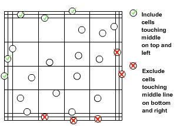
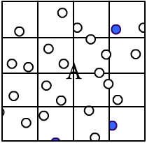

### Materials Required
 
1.	Hemocytometer plus a supply of cover slips.
2.	Uniform cell suspension.
3.	0.4% Trypan Blue stain (fresh & filtered) in phosphate buffered saline.
4.	Tally Counter.
5.	Cell Suspension.
6.	Micropipettes.
7.	Inverted microscope (preferably phase contrast).

&nbsp;
 
### Procedure
 For an accurate determination, the total number of cells overlying one 1 mm2 should be between 15 and 50. If the number of cells per 1 mm2 exceeds 50, dilute the sample and count again. If the number of cells per 1 mm2 is less than 15, use a less diluted sample. If less dilute samples are not available, count cells on both sides of the hemacytometer (8 x 1 mm2 areas).
 Keep a separate count of viable and non-viable cells. If more than 25% of cells are non-viable, the culture is not being maintained on the appropriate number of media.  Reintubate the culture and adjust the volume of media according to the confluency of the cells and the appearance of the media. Include cells on top and left touching middle line. The cells touching middle line at bottom and right are not counted.

&nbsp;
 

 Note:

i.	Trypan Blue is the "vital stain”; excluded from live cells.

ii.	 Live cells appear colourless and bright (refractile) under phase contrast.

iii.	Dead cells stain blue and are non-refractile.
 
&nbsp;

&nbsp;
 
#### 1. Obtain a uniform suspension of cells: 
Follow the trypsinization/trypsin neutralization protocol for the specific cell type. Place the cell suspension in a suitably sized conical centrifuge tube. For an accurate cell count to be obtained, a uniform suspension containing single cells is necessary. Pipette the cell suspension up and down in the tube 5-7 times using a pipette with a small bore (5 ml or 10 ml pipette). For cells thawed from cryopreservation (in 1ml cryopreservation medium), pipette up and down 7-10 times using a one ml pipette.

&nbsp;
 

#### 2.	Prepare a 1:1 dilution of the cell suspension in trypan blue: 
Approximately 10 microliters of cell suspension will be required to charge one chamber of the hemacytometer. In a conical microfuge tube, add 10 microliters of 0.4% trypan blue solution. Gently swirl (finger vortex) the cell suspension and remove 10 microliters of it using sterile technique. Combine the 10 microliters of cell suspension with the 10 microliters of trypan blue in the microfuge tube. Pipette up and down several times to ensure a uniform cell suspension using the same pipette tip and allow to stand for 5-15 minutes.

&nbsp;
 

#### 3.	Load the hemacytometer: 
Moisten and affix cover slip to the hemacytometer. Ensure the cover slip and hemacytometer are clean and grease-free (use alcohol to clean). A small amount of trypan blue-cell suspension is transferred to one of the chambers of the hemacytometer by carefully touching the cover slip at its edge with the pipette tip and allowing each chamber to fill by capillary action. The chamber should not be overfilled or underfilled.

&nbsp;
 

#### 4.	Determine the number of cells (total and viable): 
View the cells under a microscope at 100x magnification. Under the microscope, you should see a grid of 9 squares. Focus the microscope on one of the 4 outer squares in the grid. The square should contain 16 smaller squares. Count all the cells in the four 1 mm corner squares. If there are too many or too few cells to count, repeat the procedure, either concentrating or diluting the original suspension as appropriate.

&nbsp;
 

#### 5.	Calculation: 
Count 4 corner squares and calculate the average. Each large square of the hemacytometer, with cover slip in place, represents a total volume of 0.1 mm3 (1.0mm X1.0mmX 0.1mm) or 10-4 cm3. Since 1 cm3 is equivalent to approximately 1 ml, the total number of cells per ml will be determined using the following calculations:

a. %Cell Viability = [Total Viable cells (Unstained) / Total cells (Viable +Dead)] X 100.

b. Viable Cells/ml = Average viable cell counts per square x Dilution Factor x 104/

c. Average viable cell counts per square = Total number of viable cells in 4 squares / 4.

d. Dilution Factor = Total Volume (Volume of sample + Volume of diluting liquid) / Volume of sample.

e. Total viable cells/Sample = Viable Cells/ml x the original volume of fluid from which the cell sample was removed.

f. Volume of media needed = (Number of cells needed/Total number of viable cells) x 1000.

&nbsp;
 
#### 6.	Cleaning the hemacytometer: - 
Clean the instrument as soon as possible after use. Use protective clothing, gloves and eyewear. Trypan blue is a mutagen.  Clean the instrument with dilute bleach solution followed by 70% isopropanol. Air dry. Dispose of trypan blue contaminated articles in biohazard waste.
 
&nbsp;
 

### Real Lab Scenarios
 
Hemacytometer counts are, however, subject to the following sources of error:
 
#### 1. Non-uniform suspensions: 
It is assumed that the volume of cell suspension placed in the chamber represents a truly random sample. This will not be a valid assumption unless the suspension is monodispersed and free of cell clumps. Distribution in the hemacytometer chamber depends on the number of particles, rather than particle mass. Thus, cell clumps will distribute in the same way as single cells, distorting the final result. Unless 90% or more of the cells are free from contact with other cells the count should be repeated with a fresh sample from the original culture. Clumping can be minimized by keeping the suspension in an ice bath in plastic tubes, and by using a diluent without calcium and magnesium. Always mix thoroughly before sampling.

&nbsp;
 

#### 2.	Improper filling of chambers: 
In order to fill properly by capillary action, a hemacytometer chamber must be very clean and this also applies to the Micro pipette used to fill the chamber. New pipettes may be dry heat sterilized. In a laboratory where the hemacytometer is in regular use throughout the day, following rinsing with water after use, and the coverslip may be placed in small beaker containing soapy water so that it is always ready for its next use.

#### 3. clean with distilled water
The chamber and cover slip are cleaned first with distilled water, then by 70% ethanol and wiped dry. If the cell suspension does not flow in and fill the chamber immediately and smoothly when the drop from the pipette is placed in the depression under the coverslip, the chamber must be dirty and should be recleaned.

#### 4.	Failure to adopt a convention for counting cells in contact with boundary lines or each other: 
In order to determine what to count and what not to count, concerning a cell on a boarder, you should develop a convention in which you do not count half of the cells that touch a boarder. For example, you may decide not to count cells if they touch the bottom or right boarder or the top and left boarder. You can decide on your own convention but whichever you choose, you MUST be consistent. One should count the cells in the four squares of both the upper and lower chambers for the most accuracy although, in many laboratories, for convenience, only the four squares of one of the two chambers are counted.

#### 5.	Statistical error: 
With careful attention to detail, the overall error can be reduced to between 10% and 15%.

&nbsp;
 
### Precautions:
 
1.	Type of counting chambers: There are different types of counting chambers available, with different grid sizes. Some counting chambers also have grids of different sizes. Take care to know the grid height and size otherwise make calculation errors.

2.	Use the provided cover glasses: They are thicker than the standard 0.15mm cover glasses.  Therefore, they are less flexible, and the surface tension of the fluid will not deform them. The height of the fluid is standardized this way.

3.	Moving cells: Moving cells, like sperm cells, are difficult to count. The cells should immobilize first.

4.	Objective: The hemacytometer is thicker than a regular slide. Be careful to not crash the objective into the hemacytometer at the time of focusing.
 

### Usage tips
 
1. Use an appropriate dilution of the mixture with regard to the number of cells to be counted. If the sample is not dissolved well, the cells become crowded and will be difficult to count. If it is too dissolved, the sample size will not be enough to develop strong inferences about the concentration in the original mixture. Commonly, a rough idea of the concentration must be known before beginning in order to guess an appropriate dilution.

2. Bubbles are removed from the hemacytometer before counting.

3. Analyse multiple chambers.  Performed by a redundant test on a second chamber, the results can be compared. If the difference is larger, the method of taking the sample may be unreliable. The average of the results is taken for a more accurate calculation.

4. For drying the excess liquid do not use paper wipes. The capillary action that filled the chamber will then dry it out. After using trypan blue, rinse the hemacytometer with distilled water to remove the dye and allow it to dry. Alcohol or methylated spirits may also be used to sterilize the hemacytometer.

5. It is not necessary for the tube used for the trypan blue dilution to be sterile. However, if non-sterile tubes are used, make sure that all pipettes and pipette tips that come in contact with the cell suspension are sterile and that these do not come in contact with the cell suspension once they have been exposed to a non-sterile environment.

6. Count rows or columns. Use the gridlines to help remember which areas' cells have already been counted.

